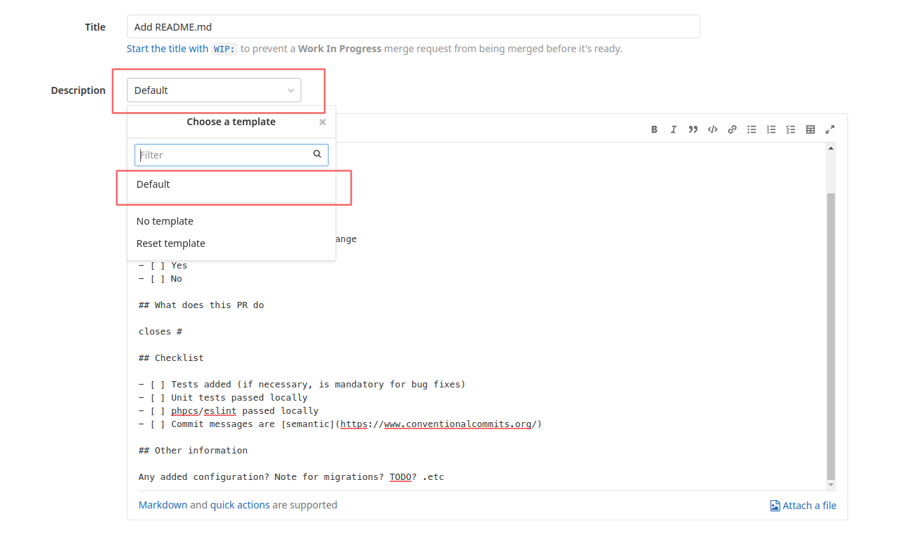

## Installation

### Github

```sh
mkdir -p .github && curl -fsSL https://raw.githubusercontent.com/ducpv-0536/git-message-template/main/.github/pull_request_template.md > .github/pull_request_template.md
```

### Gitlab

```sh
mkdir -p .gitlab/merge_request_templates && curl -fsSL https://raw.githubusercontent.com/ducpv-0536/git-message-template/main/.gitlab/merge_request_template/Default.md > .gitlab/merge_request_templates/Default.md
```

When creating new merge request, choose the *Default* template from the *Choose a template* dropdown in *Description* section.



## Usage

The following describes how you should fill in each section

### PR type

Type of the pull request. Pick all related categories.

- **Feature**: implementing a new feature.
- **Bug fix**: fix some bugs.
- **Refactor**: do some refactors (changes in code that don't affect behavior current features).
- **Add more tests**: add missing tests to improve the test suite.
- **Chore**: something not related to current code base e.g. update docs.

### Does this introduce a breaking change

Whether this PR introduces change that is not backward compatible with current codebase.
Merging this PR will require additional works to make current codebase works (update an environment variable/config name, changing config files, running DB operations .etc)
or result in changes of current features' behavior that make current user content not usable/cause error (changing template rendering, user configuration files .etc).

### What does this PR do

Describe in details what this PR do. Can be a Github/Gitlab issue or Redmine links that contain task details.

### Checklist

Tasks should be done before you create this PR. Make sure you complete all mandatory tasks before creating the PR.

### Other information

Notes on this PR. Can be about new config/environment variables, new migration, notes on how to use new function/command.
